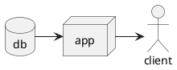

# react_task1_ex1_work

> цитата

Заголовок таблицы1 | Заголовок таблицы2
-------------------|-------------------
текст1             | текст2

```plantuml
@startuml component
actor client
node app
database db

db -> app
app -> client
@enduml
```